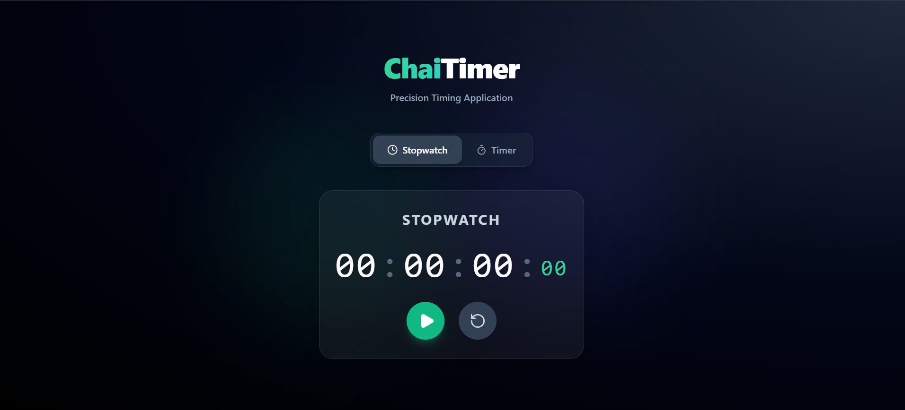
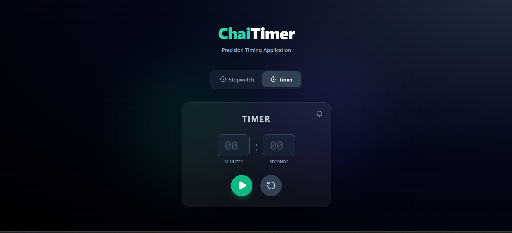

# ChaiTimer ⏱️☕

A modern, highly attractive, and responsive **Stopwatch & Timer** application built with React and Tailwind CSS. It features a sleek dark-themed UI, glassmorphism elements, and smooth animations.

### 🌐 [Live Demo](https://your-live-link-here.vercel.app)

---

## 📸 Screenshots


### Stopwatch Mode


### Timer Mode


---

## ✨ Features

- **Stopwatch:**
  - Precise timing with HH:MM:SS:MS format.
  - Start, Pause, and Reset functionalities.
  - Fluid millisecond tracking (accurate 10ms intervals).
- **Timer:**
  - Custom Minute and Second inputs.
  - Countdown feature that automatically stops at `00:00`.
  - Alert/Sound toggle when the timer finishes.
- **UI/UX:**
  - Beautiful dark mode aesthetic using Tailwind CSS.
  - Glassmorphism UI (frosted glass) for the main panels.
  - Interactive components with scaling hover/active animations.
  - Smooth tab switching between Stopwatch and Timer views.
  - Vector icons provided by `lucide-react`.

## 🚀 Tech Stack

- **React 19** - Functional components & Hooks (`useState`, `useEffect`, `useRef`)
- **Vite** - Lightning-fast frontend build tool
- **Tailwind CSS v3** - Utility-first styling for the modern web
- **Lucide React** - Beautiful SVG icons

## 💻 Running Locally

1. **Clone the repository:**
   ```bash
   git clone https://github.com/peeyushtiwari888/STOPWATCH
   cd chaitimer
   ```

2. **Install dependencies:**
   ```bash
   npm install
   ```

3. **Start the development server:**
   ```bash
   npm run dev
   ```

4. Open your browser and navigate to `http://localhost:5173`

## 📂 Project Structure

```
src/
├── components/
│   ├── Controls.jsx      # Reusable start/pause/reset buttons
│   ├── Stopwatch.jsx     # Stopwatch logic and UI
│   └── Timer.jsx         # Timer countdown logic and UI
├── App.jsx               # Main container and tab navigation
├── index.css             # Tailwind base & custom glassmorphism styles
└── main.jsx              # React entry point
```

## 🤝 Contributing
Contributions, issues, and feature requests are welcome! Feel free to check the [issues page](https://github.com/peeyushtiwari888/STOPWATCH).

